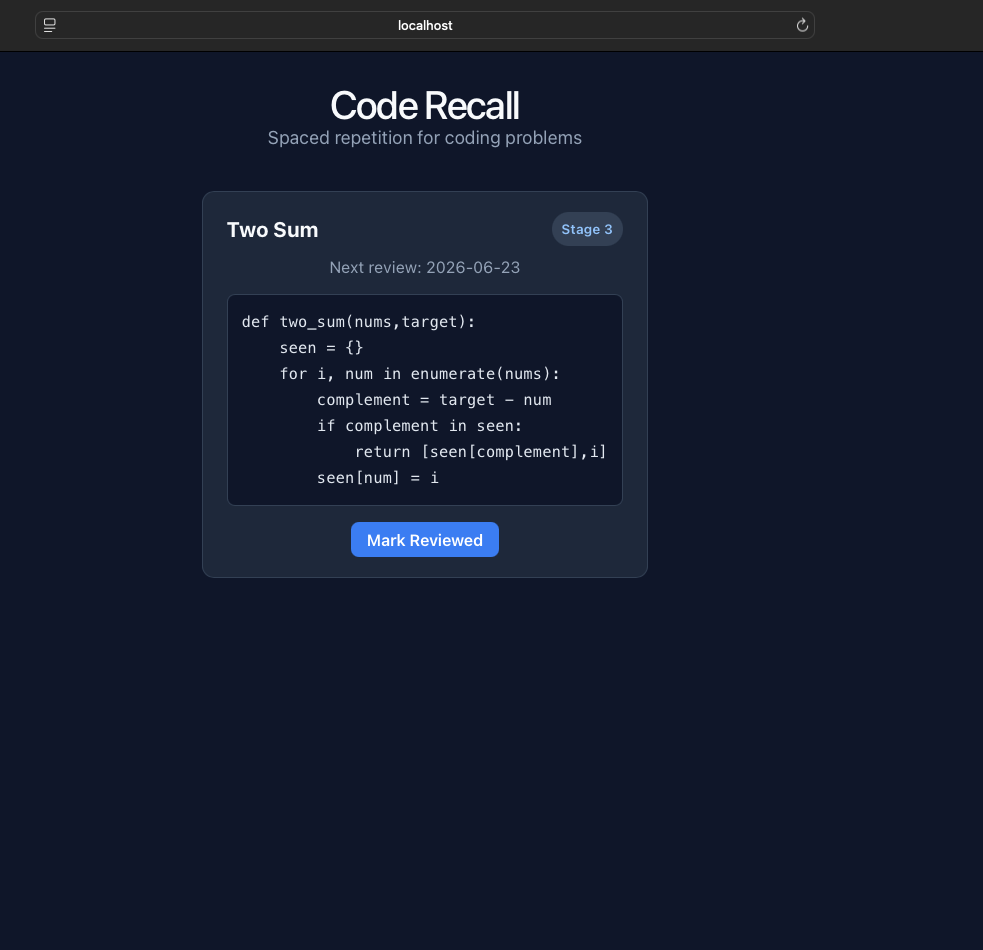
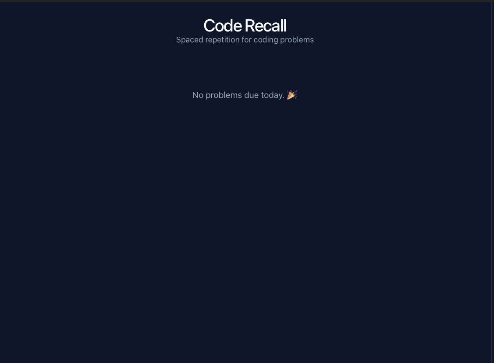

# Code Recall
A spaced-repetition tool for revisiting solved coding problems. Write your solutions in Markdown, add them via CLI, and review them on a schedule that mirrors long-term memory consolidation (7 → 28 → 60 → 180 days).




---

## What is this?
A full-stack tool that tracks coding problems you've solved and schedules them for review using a spaced repetition algorithm — the same principle behind tools like Anki. It has a Python/Flask backend with a CLI and REST API, and a React frontend dashboard for reviewing due problems.

## Why I built this
I dedicate one hour every morning to coding practice. The problem: I'd solve something, move on, and have no system to revisit it later — so the learning didn't stick. Code Recall is my answer to that. It logs every problem I solve and tells me exactly when to review it again, based on the spacing effect.

---

## Project Structure

```
code_recall/
├── backend/               # Python + Flask API + CLI
│   ├── config.py          # stage intervals, single source of truth
│   ├── database.py        # schema, constraints, initialization
│   ├── add_problem.py     # insert with duplicate protection
│   ├── due_today.py       # query due problems
│   ├── review.py          # spaced repetition logic
│   ├── parser.py          # markdown file parser
│   ├── main.py            # CLI entry point
│   ├── app.py             # Flask API entry point
│   └── two_sum.md         # example problem file
├── frontend/              # React + Vite dashboard
│   └── src/
│       ├── App.jsx
│       └── App.css
├── screenshots/
└── README.md
```

---

## Spaced Repetition Schedule

| Stage | Days Until Next Review |
|-------|------------------------|
| 0     | 7                      |
| 1     | 28                     |
| 2     | 60                     |
| 3     | 180 (capped)           |

A problem is first due for review 7 days after it's added. Each successful review advances it to the next stage and a longer interval, capping at 180 days.

---

## Backend Setup

**Requirements:** Python 3.13+

```bash
cd backend
pip install -r requirements.txt
python app.py   # runs Flask API on http://127.0.0.1:5000
```

### Adding a Problem

Problems are added via a Markdown file. See [`two_sum.md`](backend/two_sum.md) for the expected format — include a `title`, `notes`, a `## Problem` section, and a `## Solution` section. The parser reads this file and inserts it into the database.

```bash
python main.py add filepath       # add a new problem from a .md file
python main.py due                # list problems due for review today
python main.py review "<title>"   # mark a problem as reviewed
```

Run `python main.py -h` for full help.

### API Routes

| Method | Route                      | Description             |
|--------|----------------------------|-------------------------|
| POST   | `/problems`                | Add a new problem       |
| GET    | `/problems/due`            | Get due problems        |
| PUT    | `/problems/<title>/review` | Mark a problem reviewed |

---

## Frontend Setup

**Requirements:** Node.js 18+

```bash
cd frontend
npm install
npm run dev   # runs Vite dev server on http://localhost:5173
```

### Features
- Dashboard loads all due problems on mount
- Each card shows title, current stage, next review date, and solution code
- "Mark Reviewed" button sends a PUT request to the API and refreshes the list

> Note: the Flask backend must be running for the frontend to fetch data.

---

## Engineering Notes

- **Separation of concerns:** business logic functions return pure data; Flask and CLI each handle their own presentation layer
- **Consistent return shapes:** `mark_reviewed()` always returns `{"success": bool, "new_stage": ..., "next_review_date": ...}` — no isinstance checks needed in callers
- **Custom markdown parser:** `parser.py` reads frontmatter (title, notes) and extracts `## Problem` / `## Solution` sections — the `.md` file is the single source of truth
- **Duplicate-safe inserts:** `INSERT OR IGNORE` ensures re-adding an existing problem never corrupts the DB
- **CORS:** restricted to `http://localhost:5173` during development

---

## Roadmap
- [x] CLI tool with spaced repetition logic
- [x] Flask API wrapping core functions
- [x] React frontend dashboard
- [ ] Rebuild in Go

---

## Issues Encountered & Resolutions

See [CHANGELOG.md](backend/CHANGELOG.md) for a breakdown of bugs hit during development and how they were resolved.
